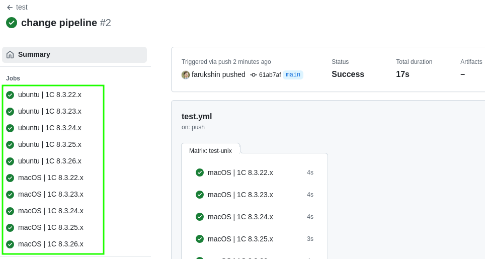

# Load28

Загрузка дистрибутивов с сайта releases.1c.ru

* [Установка](#install)
* * [Установка из исходников](#installSource)
* * [Установка из релизов](#installRelease)
* * [Установка из docker образа](#installDocker)
* [Использование](#usage)
* * [Запуск из консоли](#runcli)
* * [Использование в pipeline](#pipeline)
* * [Запуск в docker образе](#rundocker)
* [Нашли ошибку?](#err)
* [Лицензия](#lic)

Особенности:
* нет жесткой привязки к структуре сайта [https://releases.1c.ru/](https://releases.1c.ru/)
* возможно скачивать не только дистрибутивы, но и опубликованные дополнительные материалы
* гибкая настройка фильтрации кандидатов с помощью регулярных выражений

<a name="install"></a> 

## Установка

<a name="installSource"></a> 

### Установка из исходников

```
git clone https://github.com/farukshin/load28.git
cd load28
go build .
./load28 --version
```

<a name="installRelease"></a> 

### Установка из релизов

1. Получить версию [последнего релиза](https://github.com/farukshin/load28/releases).

``` bash
VERSION=$(curl -s "https://api.github.com/repos/farukshin/load28/releases/latest" | jq -r '.tag_name')
```
Или установить необходимую версию релиза:

``` bash
VERSION=vX.Y.Z
```

2. Загрузка релиза

``` bash
OS=Linux       # or Darwin, Windows
ARCH=x86_64    # or arm64, x86_64, armv6, i386, s390x
FILE=load28_${OS}_${ARCH}.tar.gz
curl -sL "https://github.com/farukshin/load28/releases/download/${VERSION}/${FILE}" > ${FILE}
```

3. Проверка контрольной суммы

``` bash
curl -sL https://github.com/farukshin/load28/releases/download/${VERSION}/load28_checksums.txt > load28_checksums.txt
shasum --check --ignore-missing ./load28_checksums.txt
```

4. Распаковать утилиту

``` bash
tar -zxvf ${FILE} load28
./load28 --version
```

<a name="installDocker"></a> 

### Установка из docker образа

`load28` можно запустить из docker образа. Сам образ можно скачать из docker hub'a

```
docker push farukshin/load28
```
или собрать локально

```
git clone https://github.com/farukshin/load28.git
cd load28
docker build -t farukshin/load28 .
```

Образ `farukshin/load28` создан на базе `scratch`, поэтому итоговый размер образа 5MB
```
docker images | grep "farukshin/load28"
> farukshin/load28   latest    8492ada2a558   7 minutes ago   5.73MB
```

<a name="usage"></a> 

## Использование

<a name="runcli"></a> 

### Запуск из консоли

```
Строка запуска: load28 [КОМАНДА] [ОПЦИИ]
КОМАНДА:
    list - вывод списка доступных дистрибутивов
    get - загрузка дистрибутива

ОПЦИИ:
    -h --help - вызов справки
    -v --version - версия приложения
    --login - пользователь портала releases.1c.ru (либо env LOAD28_USER)
    --pwd - пароль пользователя портала releases.1c.ru (либо env LOAD28_PWD)
    --soft - наименование продукта (пример: Platform83)
    --release - версия продукта (пример: 8.3.14.1855)
    --filter - фильтр поиска (регулярное выражение)
    --debug - режим отладки (для включения укажите 1 или true)

Пример запуска:
    export LOAD28_USER=user1c
    export LOAD28_PWD=pass1c
    ./load28 list
    ./load28 get --soft=Platform83 --release=8.3.26.1498 --filter="Сервер.*ARM.*RPM.*Linux" --debug=1
```

Вывод списка доступных дистрибутивов:

```
export LOAD28_USER=myuser
export LOAD28_PWD=mypassword
./load28 list | head -n 10

DevelopmentTools10=1C:Enterprise Development Tools
Executor=1C:Исполнитель
Analytics=1С:Аналитика
Conversion=1С:Конвертация данных 2.0
Conversion30=1С:Конвертация данных 3
Translator=1С:Переводчик, редакция 2.1
CollaborationSystem=1С:Сервер взаимодействия
STest=1С:Сценарное тестирование 8
Tester=1С:Тестировщик
esb=1С:Шина
```

Вывод доступных версий платформы 8.3:

```
./load28 list --soft=Platform83 | head -n 5

8.3.25.1501=8.3.25.1501
8.3.26.1498=8.3.26.1498
8.3.24.1761=8.3.24.1761
8.3.24.1758=8.3.24.1758
8.3.24.1738=8.3.24.1738
```

Скачать сервер 1С предприятия для Linux с подробным описанием процесса выбора релиз кандидата (флаг `debug`):

```
./load28 get --soft=Platform83 \
    --release=8.3.26.1498 \
    --filter="Сервер.*ARM.*RPM.*Linux" \
    --debug=1

ls | grep server
> server.arm.rpm64_8.3.26.1498.zip
```

Определить последнюю версию сервера 1С:Шины со средой разработки под linux и скачать ее:

```
./load28 list --soft=esb | head -n 1
> 6.1.6=6.1.6

./load28 get --soft=esb \
    --release=6.1.6 \
    --filter="Сервер.*средой разработки.*Linux"
> success
```

Определить доступные минорные релизы платформы 8.3.25:

```
./load28 list \
    --soft=Platform83 \
    --filter="8.3.25.*" | head -n 3

8.3.25.1501=8.3.25.1501
8.3.25.1445=8.3.25.1445
8.3.25.1394=8.3.25.1394
```

<a name="pipeline"></a> 

### Использование в pipeline

Пусть вам необходимо протестировать определенный продукт или сервис на различных версиях платформы 1С:
В пайплайне сборки можно использовать стратегию матрицы:

```
jobs:

  test-unix:
    strategy:
      fail-fast: false
      matrix:
        platform:
          - ubuntu
          - macOS
        ones:
          - 22
          - 23
          - 24
          - 25
          - 26
    name: '${{ matrix.platform }} | 1C 8.3.${{ matrix.ones }}.x'
    runs-on: ${{ matrix.platform }}-latest
    steps:
    - uses: actions/checkout@v4
    # установка 1C
    # запуск тестов
```

В том случае будут созданы 10 job'ов, по 5 на базе платформы linux и macOS, с версиями платформы 1С начиная с 8.3.22.х по 8.3.26.х. Шагами каждой джобы будут получение дистрибутива конкретного релиза, установка запуск тестируемого сервиса/продукта.



<a name="rundocker"></a> 

### Запуск в docker образе

```
docker run --rm \
    -e LOAD28_USER='myuser' \
    -e LOAD28_PWD='mypassword' \
    farukshin/load28:latest list
```

<a name="err"></a> 

## Нашли ошибку?

Если при использовании `load28` нашли ошибку - создайте [новый issues](https://github.com/farukshin/load28/issues/new). 

<a name="lic"></a> 

## Лицензия

`load28` выпускается под лицензией MIT. Подробнее [LICENSE.md](https://github.com/farukshin/load28/blob/main/LICENSE.md)
